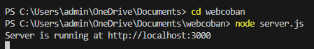

# Cách chạy web

# 1.Chuyển sang thư mục webcoban
# cd webcoban

# Ví dụ hiển thị (ở đây mình để thư mục webcoban trong Documents)
# C:\Users\admin\OneDrive\Documents> cd webcoban

# 2.Chạy server.js
# node server.js

# Ví dụ hiển thị
# C:\Users\admin\OneDrive\Documents\webcoban> node server.js

# Chạy link http://localhost:3000 trên trình duyệt để xem web
